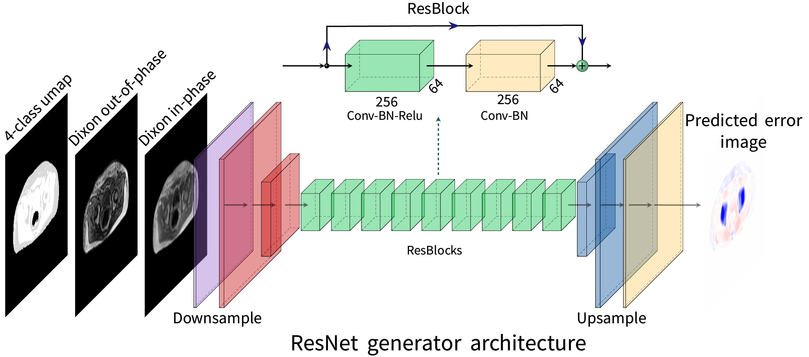

# Pelvic PET/MR attenuation correction in the image space using deep learning

A novel approach of adding bone information to the 4-class PET/MR attenuation correction method commonly used in clinical practice. The metod directly predicts the error in the PET image of bones not being included in the 4-class attenuation correction maps. 
For more information see please read our paper: [*Pelvic PET/MR attenuation correction in the image space using deep learning*](https://doi.org/10.3389/fonc.2023.1220009).

<figure>

  <figcaption><sup>The figure is adapted from Abrahamsen et al., Front Oncol (2023), DOI: [10.3389/fonc.2023.1220009](https://doi.org/10.3389/fonc.2023.1220009)</sup></figcaption>
</figure>

## Usage
The easiest way to use the code is through the supplied [dockerfile](docker/dockerfile). See the supplied docker [README.md](docker/README.md) for instructions. If visual studio code is used, the supplied devcontainer can be used to automatically set up a development environment inside the docker container. 

### Preparing data
The preprocessing of the data is performed as described in the paper. The data is expected to be stored in the following folder structure

```cmd
datasetName
├── train
│   ├── A
│   └── B
└── val
    ├── A
    └── B
```

The images in A and B are both saved numpy arrays where each saved file contains one image slice. Normally each file in A would be a (256,256,3) matrix and B a (256,256) matrix. 
A working dummy dataset can be created by running [scripts/create_debug_dataset.py](scripts/create_debug_dataset.py) from the project root folder.

### Training and Testing
The commands used for training and testing the best performing model can be found in the script [scripts/resnet_9blocks.sh](scripts/resnet_9blocks.sh).
The training is monitored using tensorboard.

## Aknowledgements
The code is based on this excellent pytorch [pix2pix implementation](https://github.com/junyanz/pytorch-CycleGAN-and-pix2pix) which again was inspired by [DCGAN](https://github.com/pytorch/examples/tree/main/dcgan). 
